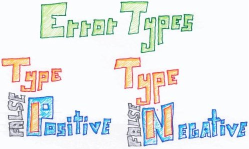
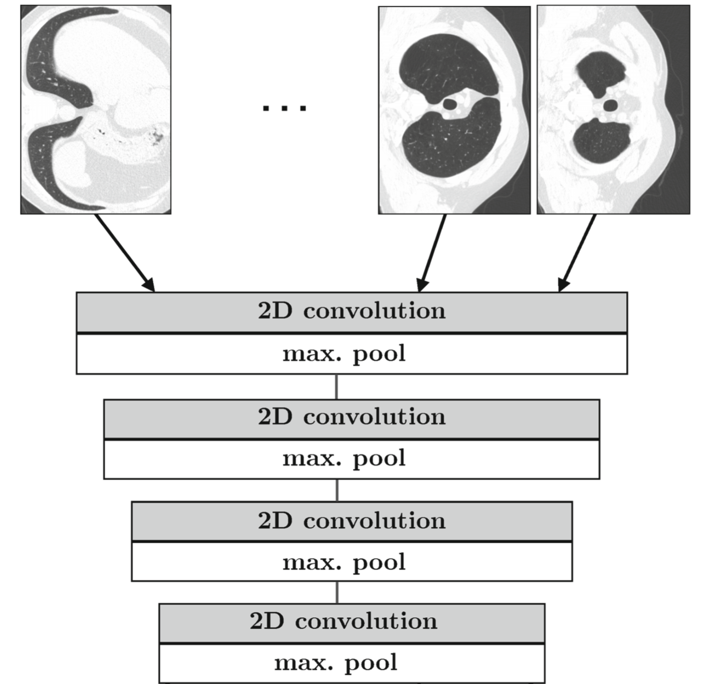
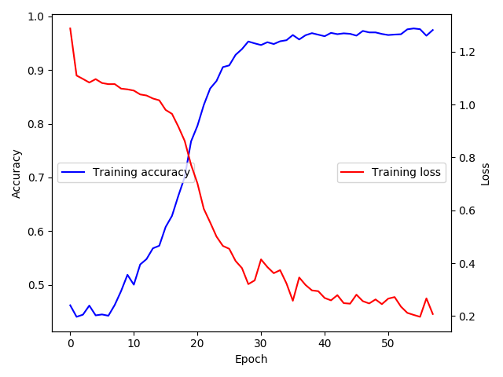

<style type="text/css">
.remark-slide-content {
    font-size: 35px;
    padding: 1em 4em 1em 4em;
}
.large { font-size: 130% }
.small { font-size: 55% }
.remark-slide-number {
  display: none;
}
figure {
  text-align: center;
  font-size: large;
}

.remark-code, .remark-inline-code { font-family: 'Source Code Pro', 'Lucida Console', Monaco, monospace;
                                    font-size: 64%;
                                  }

</style>

```{r setup, include=FALSE}
knitr::opts_chunk$set(echo = FALSE, eval = TRUE, out.height = 450)
```

# Lung cancer screening

Low-dose computed tomography (LDCT)

.center[
  <a href="https://qualityhealthcareplease.files.wordpress.com/2013/09/lung-nodule.png">
    </img>
  </a>
  ]

---

# Lung cancer screening saves lives [(NLST, 2011)](https://doi.org/10.1056/NEJMoa1102873)

.center[
  <a href="https://doi.org/10.1056/NEJMoa1102873">
    </img>
  </a>
  ]

---

# The Problem

.center[
  <a href="https://twitter.com/chrisalbon/status/1227069427125870592?s=20">
    </img>
  </a>
  ]

---

# Lung cancer screening is inefficient <a href="https://doi.org/10.1016/S2213-2600(19)30136-5">(IARC, 2018)</a>

Of 1000 individuals scanned 3 times:

.center[
  <a href="https://doi.org/10.1016/S2213-2600(19)30136-5">
    </img>
  </a>
  ]

---

# Lung cancer screening is inefficient <a href="https://doi.org/10.1016/S2213-2600(19)30136-5">(IARC, 2018)</a>

Of 1000 individuals scanned 3 times:

.center[
  <a href="https://doi.org/10.1016/S2213-2600(19)30136-5">
    </img>
  </a>
  ]

---

# Lung cancer screening benefits > harms <a href="https://doi.org/10.1016/S2213-2600(19)30136-5">(IARC, 2018)</a>

Of 1000 individuals scanned 3 times:

- Major complication from procedure: 1 in 2500 
  </img>
- Death within 60 days of procedure: 1 in 5000 
  </img>

---

# Targeted lung cancer screening [(Kovalchik, 2013)](https://www.nejm.org/doi/10.1056/NEJMoa1301851)

.center[
  <a href="https://www.nejm.org/doi/10.1056/NEJMoa1301851">
    </img>
  </a>
  ]

---

# Our approach

1. Neural network (NN)
- If negative, Emphysematous vs. Non-Emphysematous
- If positive, Benign vs. Malignant
2. Aggregation algorithm
- Combine
    - NN output with
    - Prescreening risk model output

---

# Stacking

.center[
  <a href="https://blogs.sas.com/content/subconsciousmusings/files/2017/05/modelstacking.png">
    </img>
  </a>
  ]

---

# Statistical Models
1. Bach Model
  - .small[Bach et al., (2003) Variations in lung cancer risk among smokers.JNCI 95: 470-478]
1. Prostate, Lung, Colorectal, and Ovarian Cancer Screening Trial Model 2012 (PLCOM2012)
  - .small[Tammemägi et al., (2013) Selection criteria for lung-cancer screening. NEJM 368:728-736]
1. Lung Cancer Risk Assessment Tool (LCRAT)
  - .small[Katki et al., (2016) Development and validation of risk models to select ever-smokers for CT lung cancer screening. JAMA 315:2300-2311]

---

| Covariate                         | Bach | PLCOm2012 | LCRAT |
|-----------------------------------|------|-----------|-------|
| Age                               | Yes  | Yes       | Yes   |
| Gender                            | Yes  | No        | Yes   |
| Race/ethnicity                    | No   | Yes       | Yes   |
| Education                         | No   | Yes       | Yes   |
| BMI                               | No   | Yes       | Yes   |
| Years/Age quit                    | Yes  | Yes       | Yes   |
| Years smoked                      | Yes  | Yes       | Yes   |
| Cigs per day                      | Yes  | Yes       | Yes   |
| Pack-years                        | No   | No        | Yes   |
| Lung disease                      | No   | Yes       | Yes   |
| Num. FDR w/ LC                    | No   | No        | Yes   |

---


# Cancer risk prediction

- Typically (binary) classification
  - Alive vs. Dead
  - Benign vs. Malignant
  - Cancerous vs. Non-Cancerous
  - Negative vs. Positive

.center[
  <a href="https://media.istockphoto.com/vectors/minus-plus-sign-icons-negative-and-positive-symbols-icon-set-vector-id1014086122?k=6&m=1014086122&s=170667a&w=0&h=MrFi-YgZCa1s5RL9aB0ABF5-UoHqiMiHt-MyVfW3210=">
    </img>
  </a>
  ]

---

# Image classification

.center[
  <a href="https://miro.medium.com/max/3840/1*oB3S5yHHhvougJkPXuc8og.gif">
    </img>
  </a>
  ]


---

# Image classification

.center[
  <a href="https://i1.wp.com/sourcedexter.com/wp-content/uploads/2017/05/tensorflow-1.gif?fit=1280%2C720&ssl=1">
    </img>
  </a>
  ]

---

# Emphysema

.center[
  <a href="https://doi.org/10.1093/jnci/djz041">
    </img>
  </a>
]

---

# Emphysema is commonly caused by smoking [(ALA)](https://www.lung.org/lung-health-and-diseases/lung-disease-lookup/emphysema/)

.center[
  <a href="https://doi.org/10.1093/jnci/djz041">
    </img>
  </a>
]

---

# Likelihood ratio test [(lmtest::lrtest)](https://www.rdocumentation.org/packages/lmtest/versions/0.9-36/topics/lrtest)

```
lmtest::lrtest(neg_t0, neg_emph_t0)
```

```
Model 1: case ~ log1yrisk - 1
Model 2: case ~ log1yrisk + log1yrisk:emphysema - 1

  #Df  LogLik Df  Chisq Pr(>Chisq)
1   1 -370.74
2   2 -367.43  1 6.6249   0.010056 *
---
Signif. codes:  0 ‘***’ 0.001 ‘**’ 0.01 ‘*’ 0.05 ‘.’ 0.1 ‘ ’ 1
```

---

# Deep learning versus visual scoring [(Humphries, 2018)](https://link.springer.com/chapter/10.1007/978-3-030-00946-5_32)

.center[
  <a href="https://link.springer.com/chapter/10.1007/978-3-030-00946-5_32">
    </img>
  </a>
]


---

# Model design

.center[
  </img>
  ]

---

# Input


.center[
  </img>
  ]

---

# Convolution


.center[
  </img>
  ]


---

# Batch normalization

1. Calculate the mean and variance of the layers input
  - mean: ${\mu _{B}={\frac {1}{m}}\sum _{i=1}^{m}x_{i}}$
  - variance: ${\sigma _{B}^{2}={\frac {1}{m}}\sum _{i=1}^{m}(x_{i}-\mu _{B})^{2}}$
2. Normalize the layer inputs using the previously calculated batch statistics ${\large {\hat {x}}_{i}={\frac {x_{i}-\mu_{B}}{\sqrt {\sigma _{B}^{^{2}}+\epsilon }}}}$
3. Scale and shift in order to obtain the output of the layer $\large y_{i}=\gamma {\hat {x}}_{i}+\beta$


---

# Rectified Linear Unit (ReLU)


.center[
  $$\Large f(x)=x^{+}=\max(0,x)$$
  </img>
]


---

# Max pooling

.center[
  </img>
]

$\Large max(1,1,5,6)=6$

---

# Model output

.center[
  </img>
  </img>
]


---

# Model training

.center[
  </img>
 ]
 
---

# Loss function

Cross entropy
$$\huge H(p,q)=-\sum_{x\in {\mathcal {X}}}p(x)\,\log q(x)$$

---

# Physician-annotation versus emphysema probability

```
lmtest::lrtest(neg_t0, neg_emph_t0, neg_pemph_t0)
```

```
Model 1: case ~ log1yrisk - 1
Model 2: case ~ log1yrisk + log1yrisk:emphysema - 1
Model 3: case ~ log1yrisk + log1yrisk:p_emph - 1
Model 4: case ~ log1yrisk + log1yrisk:emphysema + log1yrisk:p_emph - 1

  #Df  LogLik Df  Chisq Pr(>Chisq)
1   1 -370.74
2   2 -367.43  1 6.6249    0.01006 *
3   2 -367.23  0 0.3978    < 2e-16 ***
4   3 -365.58  1 3.2994    0.06930 .
```

---

# New approach for positive scans

```
Model          AIC     AUROC    gain_capture   deviance   lrt_p_value
lcrat_ct       1635    0.777    0.555          1613.      NA
lcp            1520    0.850    0.700          1516.      NA
lcp_lcrat      1514    0.851    0.701          1508.      0.00431
lcp_lcrat_ct   1497    0.860    0.719          1473.      0.0000673
```

---

.center[
  <a href="https://en.wikipedia.org/wiki/Lorenz_curve">
    </img>
  </a>
]

---

# Future Directions

.center[
  <a href="https://doi.org/10.1093/jnci/djz041">
    </img>
  </a>
]

---

# Global smoking deaths are on the rise [(IHME, 2018)](https://ourworldindata.org/grapher/smoking-and-secondhand-deaths)

.center[
  <a href="https://ourworldindata.org/grapher/smoking-and-secondhand-deaths">
    </img>
  </a>
  ]

---

# Future Directions

.center[
  <a href="https://www.mdedge.com/chestphysician/article/158268/lung-cancer/states-show-large-disparities-lung-cancer-mortality">
    </img>
  </a>
  ]

---

# Lung cancer mortality [(ACS, 2019)](https://www.cancer.org/research/cancer-facts-statistics/all-cancer-facts-figures/cancer-facts-figures-2019.html)

.pull.left[
  <a href="https://www.cancer.org/research/cancer-facts-statistics/all-cancer-facts-figures/cancer-facts-figures-2019.html">
    </img>
  </a>
  ]

.center[
<a href="https://www.cancer.org/research/cancer-facts-statistics/all-cancer-facts-figures/cancer-facts-figures-2019.html">
  </img>
</a>
<a href="https://www.cancer.org/research/cancer-facts-statistics/all-cancer-facts-figures/cancer-facts-figures-2019.html">
  </img>
</a>
]

---

# Smoking: top modifiable risk factor [(Islami, 2018)]( https://doi.org/10.3322/caac.21440)

.center[
  <figure>
    <a href=" https://doi.org/10.3322/caac.21440">
      </img>
    </a>
    <figcaption>Estimated Proportion and Number of Incident Cancer Cases Attributable to Evaluated Risk Factors in Adults Aged 30 Years and Older in the United States in 2014</figcaption>
  </figure>
  ]

---

# Acknowledgements

- DCEG Cancer Screening Group
  - Hormuzd Katki, PhD (preceptor)
  - Wes Caldwell
  - Hilary Robbins, PhD
  - Li Cheung, PhD
  - Christine Berg, MD
  - Anil Chaturvedi, PhD
  - Ronald M. Summers, MD, PhD

---

class: center, middle
# Thanks for listening!
---

class: center, middle
# Questions?
