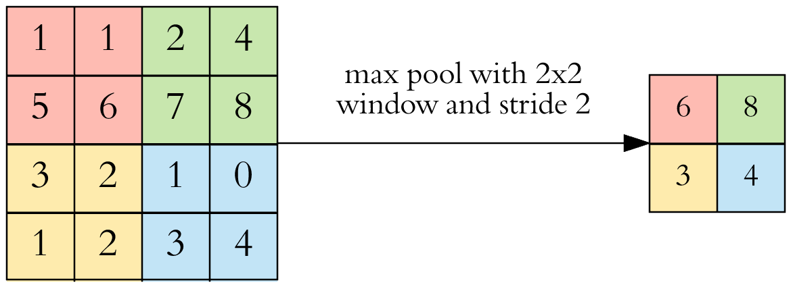

<style type="text/css">
.remark-slide-content {
    font-size: 35px;
    padding: 1em 4em 1em 4em;
}
.large { font-size: 130% }
.small { font-size: 55% }
.remark-slide-number {
  display: none;
}
figure {
  text-align: center;
  font-size: large;
}

.remark-code, .remark-inline-code { font-family: 'Source Code Pro', 'Lucida Console', Monaco, monospace;
                                    font-size: 64%;
                                  }

</style>

```{r setup, include=FALSE}
knitr::opts_chunk$set(echo = FALSE, eval = TRUE, out.height = 450)
```

# Overview

- Lung cancer screening
- Targeted screening
- Statistical modeling and deep learning
- Deep learning image analysis
- Project 1: Combined approach to deciding screening intervals 
- Project 2: Disparities in lung cancer screening and outcomes

---

# Lung cancer screening

Low-dose computed tomography (LDCT)

.center[
  <a href="https://qualityhealthcareplease.files.wordpress.com/2013/09/lung-nodule.png">
    </img>
  </a>
  ]

---

# Lung cancer screening saves lives [(NLST, 2011)](https://doi.org/10.1056/NEJMoa1102873)

.center[
  <a href="https://doi.org/10.1056/NEJMoa1102873">
    </img>
  </a>
  ]

---

# The Problem

.center[
  <a href="https://twitter.com/chrisalbon/status/1227069427125870592?s=20">
    </img>
  </a>
  ]

---

# Lung cancer screening is inefficient <a href="https://doi.org/10.1016/S2213-2600(19)30136-5">(IARC, 2018)</a>

Of 1000 individuals scanned 3 times:

.center[
  <a href="https://doi.org/10.1016/S2213-2600(19)30136-5">
    </img>
  </a>
  ]

---

# Lung cancer screening is inefficient <a href="https://doi.org/10.1016/S2213-2600(19)30136-5">(IARC, 2018)</a>

Of 1000 individuals scanned 3 times:

.center[
  <a href="https://doi.org/10.1016/S2213-2600(19)30136-5">
    </img>
  </a>
  ]

---

# Lung cancer screening benefits > harms <a href="https://doi.org/10.1016/S2213-2600(19)30136-5">(IARC, 2018)</a>

Of 1000 individuals scanned 3 times:

- Major complication from procedure: 1 in 2500 
  </img>
- Death within 60 days of procedure: 1 in 5000 
  </img>

---

# Targeted lung cancer screening [(Kovalchik, 2013)](https://www.nejm.org/doi/10.1056/NEJMoa1301851)

.center[
  <a href="https://www.nejm.org/doi/10.1056/NEJMoa1301851">
    </img>
  </a>
  ]

---

# Targeted lung cancer screening

- Targeted screening can
  - improve efficiency
  - reduce harms
  - identify individuals who can safely wait more than 1 year between screens

---

# Statistical Models
1. Bach Model
  - .small[Bach et al., (2003) Variations in lung cancer risk among smokers.JNCI 95: 470-478]
1. Prostate, Lung, Colorectal, and Ovarian Cancer Screening Trial Model 2012 (PLCOM2012)
  - .small[Tammemägi et al., (2013) Selection criteria for lung-cancer screening. NEJM 368:728-736]
1. Lung Cancer Risk Assessment Tool (LCRAT)
  - .small[Katki et al., (2016) Development and validation of risk models to select ever-smokers for CT lung cancer screening. JAMA 315:2300-2311]

---

| Covariate                         | Bach | PLCOm2012 | LCRAT |
|-----------------------------------|------|-----------|-------|
| Age                               | Yes  | Yes       | Yes   |
| Gender                            | Yes  | No        | Yes   |
| Race/ethnicity                    | No   | Yes       | Yes   |
| Education                         | No   | Yes       | Yes   |
| BMI                               | No   | Yes       | Yes   |
| Years/Age quit                    | Yes  | Yes       | Yes   |
| Years smoked                      | Yes  | Yes       | Yes   |
| Cigs per day                      | Yes  | Yes       | Yes   |
| Pack-years                        | No   | No        | Yes   |
| Lung disease                      | No   | Yes       | Yes   |
| Num. FDR w/ LC                    | No   | No        | Yes   |

---

# New targeted lung cancer screening approach

- LCRAT+CT (Lung Cancer Risk Assessment Tool plus Computed Tomography)
  - individualized statistical model
  - predicts lung cancer risk
  - uses pre-screening risk-factors and CT image features
- LCP-CNN (Lung Cancer Prediction - Convoluted Neural Network)
  - deep-learning algorithm
  - provides malignancy score for lung nodules
  - uses CT image features

---

# Image classification

.center[
  <a href="https://miro.medium.com/max/3840/1*oB3S5yHHhvougJkPXuc8og.gif">
    </img>
  </a>
  ]


---

# Image classification

.center[
  <a href="https://i1.wp.com/sourcedexter.com/wp-content/uploads/2017/05/tensorflow-1.gif?fit=1280%2C720&ssl=1">
    </img>
  </a>
  ]

---

# Input


.center[
  </img>
  ]

---

# Convolution


.center[
  </img>
  ]


---


# Rectified Linear Unit (ReLU)


.center[
  $$\Large f(x)=x^{+}=\max(0,x)$$
  </img>
]


---

# Max pooling

.center[
  </img>
]

$\Large max(1,1,5,6)=6$

---

# Dropout

.center[
  </img>
]


---
# Dropout

.center[
  </img>
]


---

# Cancer risk prediction

- Typically (binary) classification
  - Alive vs. Dead
  - Benign vs. Malignant
  - Cancerous vs. Non-Cancerous
  - Negative vs. Positive

.center[
  <a href="https://media.istockphoto.com/vectors/minus-plus-sign-icons-negative-and-positive-symbols-icon-set-vector-id1014086122?k=6&m=1014086122&s=170667a&w=0&h=MrFi-YgZCa1s5RL9aB0ABF5-UoHqiMiHt-MyVfW3210=">
    </img>
  </a>
  ]


---

# One-year lung cancer risk distribution

.center[
  <a href="https://en.wikipedia.org/wiki/Statistical_risk">
    </img>
  </a>
]

---

# Annual versus biennial screening intervals 

.center[
  <a href="https://en.wikipedia.org/wiki/Lorenz_curve">
    </img>
  </a>
]

---

# Lung cancer screening disparities

.center[
  <a href="https://www.healio.com/news/hematology-oncology/20200901/stand-up-to-cancer-receives-grant-to-reduce-disparities-in-research">
    </img>
  </a>
]

---

# Lung cancer screening disparities

.center[
  <a href="https://www.healio.com/news/hematology-oncology/20201008/risk-prediction-model-may-reduce-racial-disparities-in-lung-cancer-screening-outcomes">
    </img>
  </a>
]

.small[  
  [Pasquinelli, Mary M. et al. Journal of Thoracic Oncology, Volume 15, Issue 11, August 2020, 1738 - 1747](https://doi.org/10.1016/j.jtho.2020.08.006)
]
---

# Lung cancer screening disparities

.center[
  <a href="https://www.healio.com/news/hematology-oncology/20200506/racial-disparities-observed-in-guidelinerecommended-lung-cancer-imaging">
    </img>
  </a>
]
  
.small[  
  [Rustain L Morgan, et al., JNCI: Journal of the National Cancer Institute,  Volume 112, Issue 12, December 2020, 1204–1212](https://academic.oup.com/jnci/article/112/12/1204/5781960)
]
---

# Statistical models can augment guidelines

.center[
  <a href="https://en.wikipedia.org/wiki/Lorenz_curve">
    </img>
  </a>
]
  
---

# Life-years gained versus risk

Individuals who are:
- Recent heavy smokers (>30 pack-years, <15 quit-years)
- older (>55 years old)
- are at higher risk
- have fewer gainable life-years 

30 pack-year example: 2 packs per day x 15 years
---

# Statistical models can augment guidelines

.center[
  <a href="https://en.wikipedia.org/wiki/Quality-adjusted_life_year">
    </img>
  </a>
]  

---

# Conclusions

Statistical models can be
- combined with deep learning image analysis to improve screening efficiency
- used to enhance guidelines in order to reduce health disparities

---

# Acknowledgements

- DCEG Cancer Screening Group
  - Hormuzd Katki, PhD (preceptor)
  - Rebecca Landy, PhD
  - Corey Young, MS
  - Hilary Robbins, PhD
  - Li Cheung, PhD
  - Christine Berg, MD
  - Anil Chaturvedi, PhD
  - Ronald M. Summers, MD, PhD

---

class: center, middle
# Thanks for listening!
---

class: center, middle
# Questions?
