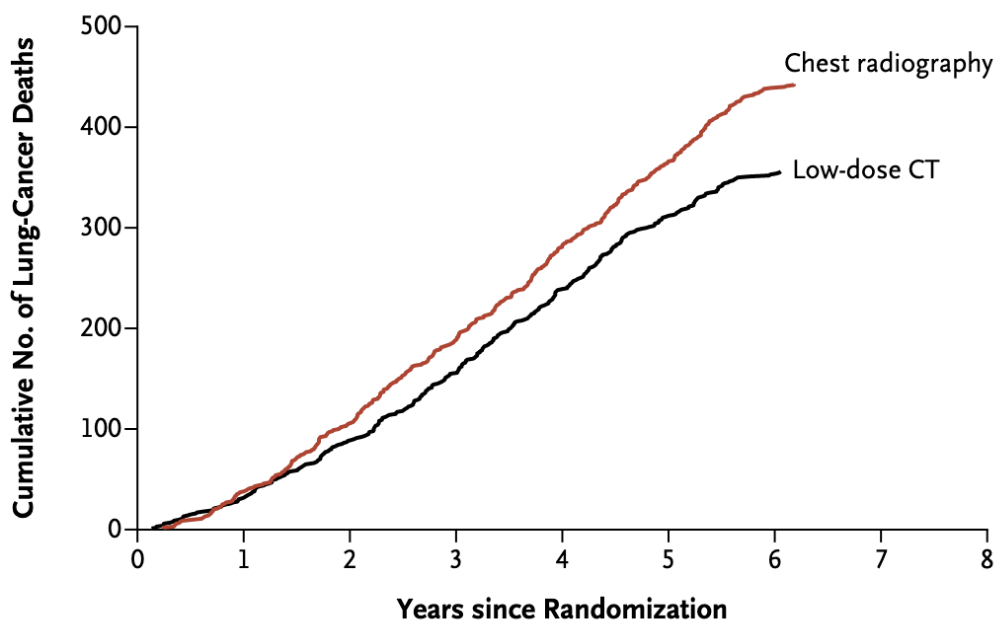

<style type="text/css">
.remark-slide-content {
    font-size: 35px;
    padding: 1em 4em 1em 4em;
}
.large { font-size: 130% }
.small { font-size: 55% }
.remark-slide-number {
  display: none;
}
figure {
  text-align: center;
  font-size: large;
}

.remark-code, .remark-inline-code { font-family: 'Source Code Pro', 'Lucida Console', Monaco, monospace;
                                    font-size: 64%;
                                  }

</style>

```{r setup, include=FALSE}
knitr::opts_chunk$set(echo = FALSE, eval = TRUE, out.height = 450)
```

# Goal

- Contribute to cancer risk prediction methods

--

- Improve efficiency of cancer screening

--

  - Reduce harms

--

  - Maximize benefits

--

  - Decrease costs

--

More 💥 for our 💰

---

# Lung cancer: top killer [(ACS, 2019)](https://www.cancer.org/research/cancer-facts-statistics/all-cancer-facts-figures/cancer-facts-figures-2019.html)


.center[
  <a href="https://www.cancer.org/research/cancer-facts-statistics/all-cancer-facts-figures/cancer-facts-figures-2019.html">
    </img>
  </a>
  ]

---

# Smoking: top modifiable risk factor [(Islami, 2018)]( https://doi.org/10.3322/caac.21440)

.center[
  <figure>
    <a href=" https://doi.org/10.3322/caac.21440">
      </img>
    </a>
    <figcaption>Estimated Proportion and Number of Incident Cancer Cases Attributable to Evaluated Risk Factors in Adults Aged 30 Years and Older in the United States in 2014</figcaption>
  </figure>
  ]

---

# US smoking deaths tapering off [(ACS, 2019)](https://www.cancer.org/research/cancer-facts-statistics/all-cancer-facts-figures/cancer-facts-figures-2019.html)

.center[
  <a href="https://www.cancer.org/research/cancer-facts-statistics/all-cancer-facts-figures/cancer-facts-figures-2019.html">
    </img>
  </a>
  ]
.center[
  <a href="https://www.cancer.org/research/cancer-facts-statistics/all-cancer-facts-figures/cancer-facts-figures-2019.html">
    </img>
  </a>
  ]

---

# Global smoking deaths are on the rise [(IHME, 2018)](https://ourworldindata.org/grapher/smoking-and-secondhand-deaths)

.center[
  <a href="https://ourworldindata.org/grapher/smoking-and-secondhand-deaths">
    </img>
  </a>
  ]

---

# Lung cancer screening saves lives [(NLST, 2011)](https://doi.org/10.1056/NEJMoa1102873)

.center[
  <a href="https://doi.org/10.1056/NEJMoa1102873">
    </img>
  </a>
  ]

---

# Lung cancer screening is inefficient <a href="https://doi.org/10.1016/S2213-2600(19)30136-5">(IARC, 2018)</a>

Of 1000 individuals scanned 3 times:

.center[
  <a href="https://doi.org/10.1016/S2213-2600(19)30136-5">
    </img>
  </a>
  ]


---

# Lung cancer screening is inefficient <a href="https://doi.org/10.1016/S2213-2600(19)30136-5">(IARC, 2018)</a>

Of 1000 individuals scanned 3 times:

.center[
  <a href="https://doi.org/10.1016/S2213-2600(19)30136-5">
    </img>
  </a>
  ]

---

# Lung cancer screening is inefficient <a href="https://doi.org/10.1016/S2213-2600(19)30136-5">(IARC, 2018)</a>

Of 1000 individuals scanned 3 times:

- Major complication from procedure: 1 in 2500 
- Death within 60 days of procedure: 1 in 5000 

---

# Targeted lung cancer screening [(Kovalchik, 2013)](https://www.nejm.org/doi/10.1056/NEJMoa1301851) 

.center[
  <a href="https://www.nejm.org/doi/10.1056/NEJMoa1301851">
    </img>
  </a>
  ]

---

# High-risk NLST participants [(Robbins, 2019)](https://doi.org/10.1093/jnci/djz041)

.center[
  <a href="https://doi.org/10.1093/jnci/djz041">
    </img>
  </a>
]


---

# Consolidation

.center[
  <a href="https://doi.org/10.1093/jnci/djz041">
    </img>
  </a>
]

---

# Emphysema

.center[
  <a href="https://doi.org/10.1093/jnci/djz041">
    </img>
  </a>
]

---

# Emphysema is commonly caused by smoking [(ALA)](https://www.lung.org/lung-health-and-diseases/lung-disease-lookup/emphysema/)

.center[
  <a href="https://doi.org/10.1093/jnci/djz041">
    </img>
  </a>
]


---
# Statistical Models
1. Bach Model
  - .small[Bach et al., (2003) Variations in lung cancer risk among smokers.JNCI 95: 470-478]
1. Prostate, Lung, Colorectal, and Ovarian Cancer Screening Trial Model 2012 (PLCOM2012)
  - .small[Tammemägi et al., (2013) Selection criteria for lung-cancer screening. NEJM 368:728-736]
1. Lung Cancer Risk Assessment Tool (LCRAT)
  - .small[Katki et al., (2016) Development and validation of risk models to select ever-smokers for CT lung cancer screening. JAMA 315:2300-2311]

---
# Statistical Models
Lung Cancer Risk Assessment Tool plus CT (LCRAT+CT)
$$ \Huge r(x)={r_0(x)}^{β_0+CTemp*β_1} $$
- $\large r(x)$ : future risk of lung cancer
- $\large r_0(x)$ : pre-screening risk
- $\large x$ : risk factors in LCRAT
- $\large CTemp=1$ if emphysema was detected 
- $\large CTemp=0$ if not
---

# Likelihood ratio test [(lmtest::lrtest)](https://www.rdocumentation.org/packages/lmtest/versions/0.9-36/topics/lrtest)

```
Model 1: case ~ log1yrisk - 1
Model 2: case ~ log1yrisk + log1yrisk:emphysema - 1
Model 3: case ~ log1yrisk + log1yrisk:consolidation - 1
Model 4: case ~ log1yrisk + log1yrisk:consolidation + log1yrisk:emphysema - 1

  #Df  LogLik Df  Chisq Pr(>Chisq)    
1   1 -370.74                         
2   2 -367.43  1 6.6249   0.010056 *  
3   2 -370.20  0 5.5477  < 2.2e-16 ***
4   3 -366.64  1 7.1295   0.007583 ** 
---
Signif. codes:  0 ‘***’ 0.001 ‘**’ 0.01 ‘*’ 0.05 ‘.’ 0.1 ‘ ’ 1
```

---


# Future Directions
- Determine how socioeconomic factors interact with cancer risk
- Create combined lung risk calculator
  - that image-detected features and air quality data
  - to calculate lung cancer risk
  - for individuals that have undergone chest CT screening
  
- Calculate how the impact of screening (life years gained) varies geographically
---
# Acknowledgements

- DCEG Cancer Screening Group
  - Hormuzd Katki, PhD (preceptor)
  - Wes Caldwell
  - Hilary Robbins, PhD
  - Li Cheung, PhD
  - Christine Berg, MD
  - Anil Chaturvedi, PhD
  - Ronald M. Summers, MD, PhD
  
---
class: center, middle
# Thanks for listening!
---
class: center, middle
# Questions?

---
